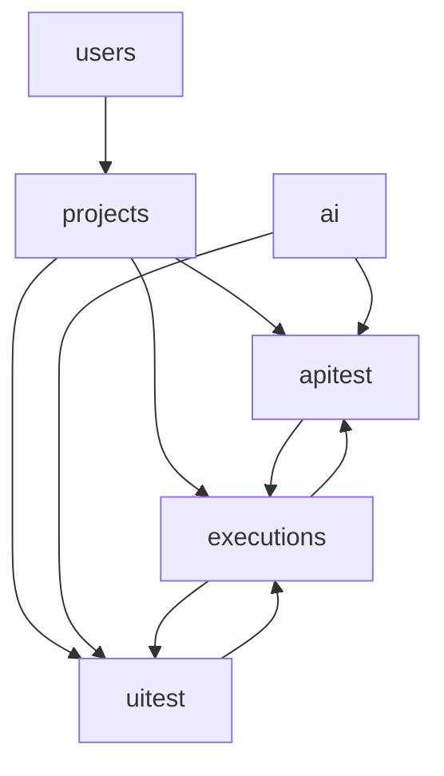

# AI 自动化测试平台 - MVP 架构设计文档

| 版本 | 日期       | 作者         |
| ---- | ---------- | ------------ |
| V1.0 | 2026-04-25 | 测试架构团队 |

---

## 1. 文档说明

本文档基于《AI 自动化测试平台 PRD V1.0》，定义 MVP 阶段的技术架构、模块职责、数据模型及代码规范，供 Vibe Coding 及后续敏捷迭代使用。

**MVP 聚焦原则**：只有多项目工作区、无复杂权限、无评审流、无分布式执行、无 Allure 集成。优先跑通“输入需求→AI 生成脚本→在线编辑→服务端执行→即时通知”全闭环。

---

## 2. 项目整体结构说明

### 2.1 系统分层

系统采用前后端分离部署，后端通过 RESTful API 与前端交互，同时通过 WebSocket 推送执行日志。

```
┌──────────────────────────────────────────────────────────┐
│                 前端 SPA (Vue3 + Element Plus)            │
│        (静态资源可单独部署，或由 Django 统一托管)         │
└──────────────────────────┬───────────────────────────────┘
                           │ HTTPS
┌──────────────────────────▼───────────────────────────────┐
│                  后端应用 (Django + DRF)                  │
│                                                          │
│  Apps: users, projects, apitest, uitest, ai, executions  │
│                                                          │
│  异步任务: Celery + Redis                                │
│  实时推送: Django Channels (可选)                        │
│                                                          │
│  AI 网关: LangChain → 外部 LLM API                       │
└──────────────────────────┬───────────────────────────────┘
                           │ 内部调用
┌──────────────────────────▼───────────────────────────────┐
│                    共享执行环境 (本机)                     │
│  · Python 3.10+ 虚拟环境                                 │
│  · Chromium Headless (Playwright)                        │
│  · 网络：可访问被测服务 + 出网至 LLM API                  │
└──────────────────────────────────────────────────────────┘
```

- **前端**：开发和构建使用 Vite，最终打包为静态文件。MVP 阶段可直接放入 Django 的静态服务，降低部署复杂度。
- **后端**：Django 4.2+，通过 Django REST Framework 提供 API，Celery 处理测试执行任务。
- **数据库与存储**：PostgreSQL 存储业务数据；MinIO（或本地文件系统）存储截图、日志等非结构化文件。

### 2.2 目录结构概要

```
backend/
├── config/                 # Django 项目配置
│   ├── settings/
│   │   ├── base.py
│   │   ├── dev.py
│   │   └── prod.py
│   ├── urls.py
│   └── celery.py
├── apps/
│   ├── users/              # 用户扩展
│   ├── projects/           # 项目空间
│   ├── apitest/            # API 测试模块
│   ├── uitest/             # Web UI 测试模块
│   ├── ai/                 # AI 服务封装
│   └── executions/         # 执行调度与结果
├── templates/              # 管理后台模板 (Django Admin 增强)
├── requirements/
│   ├── base.txt
│   └── dev.txt
└── manage.py

frontend/                   # 独立前端项目
├── src/
│   ├── views/              # 页面组件
│   ├── components/         # 公共组件
│   ├── api/                # Axios 封装
│   └── store/              # Pinia 状态
├── vite.config.js
└── package.json
```

---

## 3. 核心模块划分

### 3.1 模块一览

| Django App   | 职责                                 | 包含的关键模型                     |
| ------------ | ------------------------------------ | ---------------------------------- |
| `users`      | 用户注册/登录，个人设置              | `User`（扩展）                     |
| `projects`   | 多项目隔离，成员管理                 | `Project`, `ProjectMember`         |
| `apitest`    | API 用例管理、环境配置、Swagger 导入 | `ApiEnvironment`, `ApiTestCase`    |
| `uitest`     | UI 用例管理、环境配置                | `UIEnvironment`, `UITestCase`      |
| `ai`         | 封装 LangChain，生成测试脚本         | （无持久模型，只有任务记录可选）   |
| `executions` | 执行任务创建、调度、结果收集         | `ExecutionTask`, `ExecutionResult` |

### 3.2 模块间依赖关系



- `projects` 是所有业务资源的隔离容器。
- `ai` 模块调用外部 LLM，生成代码字符串，供 `apitest` / `uitest` 接收后保存为用例。
- `executions` 通过反向 FK 关联到具体用例类型（使用通用外键或抽象基类）。

---

## 4. 数据模型设计

### 4.1 通用基础

所有业务模型都继承一个 `BaseModel`：

```python
class BaseModel(models.Model):
    created_at = models.DateTimeField(auto_now_add=True)
    updated_at = models.DateTimeField(auto_now=True)

    class Meta:
        abstract = True
```

### 4.2 用户与项目

```python
# users/models.py
class UserProfile(models.Model):
    user = models.OneToOneField('auth.User', on_delete=models.CASCADE)
    dingtalk_id = models.CharField(max_length=64, blank=True)   # 预留通知对接

# projects/models.py
class Project(BaseModel):
    name = models.CharField(max_length=100)
    description = models.TextField(blank=True)
    owner = models.ForeignKey('auth.User', on_delete=models.PROTECT)
    # MVP 中所有成员均可编辑，不再细分角色

class ProjectMember(BaseModel):
    project = models.ForeignKey(Project, on_delete=models.CASCADE)
    user = models.ForeignKey('auth.User', on_delete=models.CASCADE)
    # 加入时间等

    class Meta:
        unique_together = ('project', 'user')
```

### 4.3 API 测试模块

```python
# apitest/models.py
class ApiEnvironment(BaseModel):
    project = models.ForeignKey(Project, on_delete=models.CASCADE, related_name='api_envs')
    name = models.CharField(max_length=100)
    base_url = models.URLField()
    headers = models.JSONField(default=dict, blank=True)        # 公共请求头
    variables = models.JSONField(default=dict, blank=True)      # 可替换变量

class ApiTestCase(BaseModel):
    DRAFT = 'draft'
    READY = 'ready'
    STATUS_CHOICES = [(DRAFT, '草稿'), (READY, '就绪')]

    project = models.ForeignKey(Project, on_delete=models.CASCADE, related_name='api_cases')
    title = models.CharField(max_length=200)
    description = models.TextField(blank=True)
    status = models.CharField(max_length=10, choices=STATUS_CHOICES, default=DRAFT)

    # 请求定义（用于前台展示和快速了解，实际执行以脚本为准）
    method = models.CharField(max_length=10, default='GET')
    path = models.CharField(max_length=500)
    headers = models.JSONField(default=dict, blank=True)
    query_params = models.JSONField(default=dict, blank=True)
    body = models.TextField(blank=True)                         # JSON 或原始文本

    # 自动化脚本 (Python 代码)
    script = models.TextField(blank=True)

    # 统计信息
    last_run_status = models.CharField(max_length=10, null=True)
    last_run_at = models.DateTimeField(null=True)
```

### 4.4 Web UI 测试模块

```python
# uitest/models.py
class UIEnvironment(BaseModel):
    project = models.ForeignKey(Project, on_delete=models.CASCADE, related_name='ui_envs')
    name = models.CharField(max_length=100)
    target_url = models.URLField()
    browser = models.CharField(max_length=20, default='chromium')   # chromium/firefox/webkit
    viewport = models.CharField(max_length=20, default='1280x720')
    implicit_wait = models.FloatField(default=5.0)

class UITestCase(BaseModel):
    DRAFT = 'draft'
    READY = 'ready'
    STATUS_CHOICES = [(DRAFT, '草稿'), (READY, '就绪')]

    project = models.ForeignKey(Project, on_delete=models.CASCADE, related_name='ui_cases')
    title = models.CharField(max_length=200)
    description = models.TextField(blank=True)
    status = models.CharField(max_length=10, choices=STATUS_CHOICES, default=DRAFT)

    # 自动化脚本 (Playwright Python 代码)
    script = models.TextField(blank=True)

    # 预设元素定位（可选，MVP 可留空）
    elements_snapshot = models.JSONField(null=True, blank=True)

    last_run_status = models.CharField(max_length=10, null=True)
    last_run_at = models.DateTimeField(null=True)
```

### 4.5 执行与结果

```python
# executions/models.py
class ExecutionTask(BaseModel):
    PENDING = 'pending'
    RUNNING = 'running'
    FINISHED = 'finished'
    STATUS_CHOICES = [(PENDING, '等待'), (RUNNING, '执行中'), (FINISHED, '已完成')]

    project = models.ForeignKey(Project, on_delete=models.CASCADE)
    trigger = models.CharField(max_length=20, default='manual')    # manual / cron
    status = models.CharField(max_length=10, choices=STATUS_CHOICES, default=PENDING)
    started_at = models.DateTimeField(null=True)
    finished_at = models.DateTimeField(null=True)
    summary = models.JSONField(null=True)                          # {total, passed, failed, error}

class ExecutionResult(BaseModel):
    task = models.ForeignKey(ExecutionTask, on_delete=models.CASCADE, related_name='results')
    # 通过 ContentType 关联不同类型用例，支持扩展
    content_type = models.ForeignKey('contenttypes.ContentType', on_delete=models.CASCADE)
    object_id = models.PositiveIntegerField()
    test_case = GenericForeignKey('content_type', 'object_id')

    status = models.CharField(max_length=10)                      # pass / fail / error
    duration = models.FloatField(null=True)                       # 秒
    logs = models.TextField(blank=True)
    screenshots = models.JSONField(default=list)                  # 截图文件路径列表
    request_response = models.JSONField(default=dict)             # API 用例专用
    error_message = models.TextField(blank=True)
```

---

## 5. 模块接口与交互时序

### 5.1 AI 生成流程

```
前端上传 Swagger 文件 → apitest 解析接口列表 → ai.generate_api_script(interfaces) → 返回脚本字符串
前端展示 Monaco Editor，用户编辑后保存到 ApiTestCase.script。
```

AI 服务内部使用 LangChain，Prompt 模板统一存放在 `ai/prompts/`，可热更新。

### 5.2 手动执行流程

```
前端选择多个用例 → POST /api/executions/tasks/ → Celery 任务创建
Worker 任务：
  1. 创建临时 pytest 项目目录
  2. 将选中的用例脚本写入 test_*.py
  3. 注入 conftest.py (包含 fixture: api_client, browser_page)
  4. 执行 pytest → 收集原始结果
  5. 解析结果写入 ExecutionResult，上传截图/日志
  6. 更新 ExecutionTask 状态和摘要
  7. 触发通知（IM Webhook）
前端轮询或通过 WebSocket 获取任务状态，刷新结果列表。
```

---

## 6. 代码规范建议

### 6.1 Python / Django 后端

- **PEP 8** 严格遵守，使用 `black` + `isort` + `flake8` 作为 CI 检查。
- **Django 模型**：类名用单数，表名自动生成不要加 `t_` 前缀。
- **字段设计**：避免 `null=True` 与 `blank=True` 混淆。`CharField` 必须指定 `max_length`。
- **关系**：尽量使用 `related_name`，避免隐式反向关系名混乱。
- **视图**：使用 DRF `ModelViewSet` 或 `generics`，搭配 `permission_classes` 加项目级隔离。
- **Celery 任务**：统一放在 `tasks.py`，任务函数保持幂等，失败重试限制次数。
- **环境分离**：使用 `django-environ` 管理配置，区分 `dev` 和 `prod`。出网 AI API Key 等敏感信息必须走环境变量。

### 6.2 AI 模块规范

- 所有 Prompt 模板单独存放于 `ai/prompts/`，用 `.txt` 或 `.yaml`，不得硬编码在代码中。
- 生成的脚本必须符合 `pytest` 约定：函数以 `test_` 开头，使用 `assert` 断言。
- 对 AI 输出必须做后处理：去除可能的 markdown 代码块标记 (```)，提取纯 Python 代码。

### 6.3 前端 (Vue3)

- 使用 Composition API 和 `<script setup>` 风格。
- 组件文件命名：`PascalCase.vue`。
- API 调用统一封装在 `api/` 目录，按模型分组（`api/projects.js`, `api/apitest.js`）。
- 状态管理 Pinia：仅对需要跨组件共享的状态使用，避免过多 store。
- 在线编辑器使用 `monaco-editor` 并封装为组件，支持 Python 语法高亮和深色主题。
- UI 框架 Element Plus 按需引入，减少打包体积。

### 6.4 测试执行脚本规范（由平台生成的用例）

- API 脚本模板：
  ```python
  import pytest
  from testlib.apiclient import ApiClient

  def test_example(api_client: ApiClient):
      response = api_client.get("/users")
      assert response.status_code == 200
      assert response.json()["total"] > 0
  ```
- UI 脚本模板：
  ```python
  import pytest
  from playwright.sync_api import Page

  def test_login(page: Page):
      page.goto("https://example.com/login")
      page.fill("#username", "admin")
      page.fill("#password", "admin")
      page.click("button[type=submit]")
      assert page.url.endswith("/dashboard")
  ```
- 平台提供 `conftest.py`，定义内置 fixtures (`api_client`, `page`)，脚本只需关注测试逻辑。

---

## 7. 部署结构（MVP）

```
Docker Compose 服务编排：
  - django:     Django + Gunicorn
  - celery:     Celery Worker (可直接复用 django 镜像)
  - redis:      消息队列
  - db:         PostgreSQL 14
  - minio:      文件存储 (可选，MVP 可先用本地挂载卷)
  - frontend:   Nginx 提供 Vue 静态文件，并反向代理 /api 到 django
```

所有服务在一个内网主机或小团队服务器上运行，仅 AI 调用需要出网。
